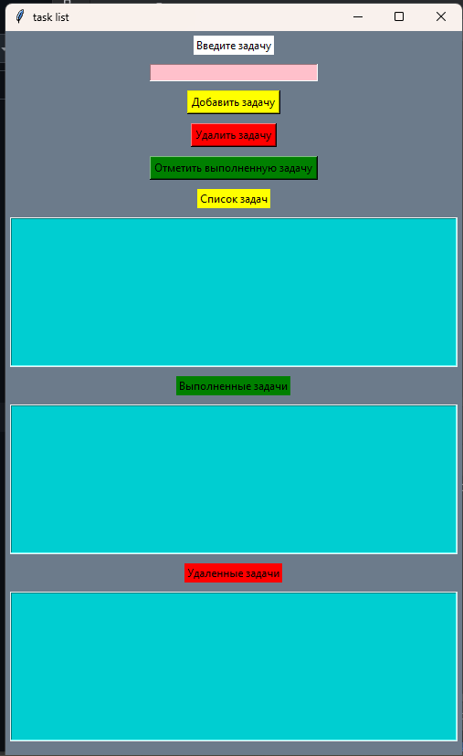

# Портфолио Артема Лаврова

## 🚀 Обо мне

Python-разработчик с опытом создания:
- Desktop-приложений (Tkinter, PyGame)
- Веб-решений (Flask, Django)
- Чат-ботов (Telebot, Aiogram)
- Парсеров данных (Selenium, Scrapy, Beautiful Soup)
- Работы с базами данных (SQL, MySQL, SQLite)

**Почему стоит выбрать меня?**
- ✅ Полный цикл разработки – от проектирования до запуска
- ✅ Гибкость в технологиях – работа с разными стеками
- ✅ Чистый и поддерживаемый код (SOLID, DRY, PEP8)
- ✅ Ответственность и соблюдение дедлайнов

## 🛠 Технические навыки

### Языки программирования
- Python
- HTML
- CSS

### Базы данных
- MySQL
- PostgreSQL

### Инструменты и технологии
- Git, Linux, Docker (базовый)
- PyCharm, Repl.it
- GPT, AI-инструменты

### Библиотеки Python
- **Web**: Flask, Django, Requests
- **Data**: Pandas, NumPy, Matplotlib
- **GUI**: Tkinter, Pygame, Pillow
- **Parsing**: Selenium, Scrapy, BeautifulSoup

## 🏆 Проекты

### 🤖 Чат-бот AI-ассистент в Telegram
**NeuroBot1** - мотивационный бот с функциями:
- Установка и отслеживание целей
- Персонализированные рекомендации
- Ежедневные мотивационные цитаты
- Интеграция с календарем
- Мультимедийный контент

### 🎮 Игра "No-Exit" на PyGame
2D-платформер с:
- Тремя уровнями сложности
- Интересным сюжетом
- Реализацией принципов ООП и SOLID

### 📝 Приложение "Задачник"
Аналог блокнота для:
- Записи повседневных задач
- Управления целями
- Организации времени

### 🔍 Парсер цен на аренду квартир с CIAN
Проект включает:
- Парсинг динамического контента
- Обработку данных (Pandas, NumPy)
- Визуализацию (Matplotlib)
- Генерацию CSV-отчетов

## 📫 Контакты

- 📧 Email: [lavrovartem0511@gmail.com](mailto:lavrovartem0511@gmail.com)
- 💻 GitHub: [Crowley55555](https://github.com/Crowley55555)
- 📂 Портфолио: [Portfolio_Lavrov_Artem](https://github.com/Crowley55555/Portfolio_Lavrov_Artem.git)
- 🔗 LinkedIn: [Указать ссылку](#)

## 🌐 Онлайн-версия портфолио
Доступна по ссылке: [Указать ссылку на GitHub Pages или хостинг](#)
