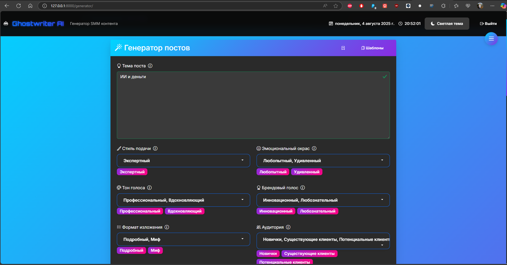
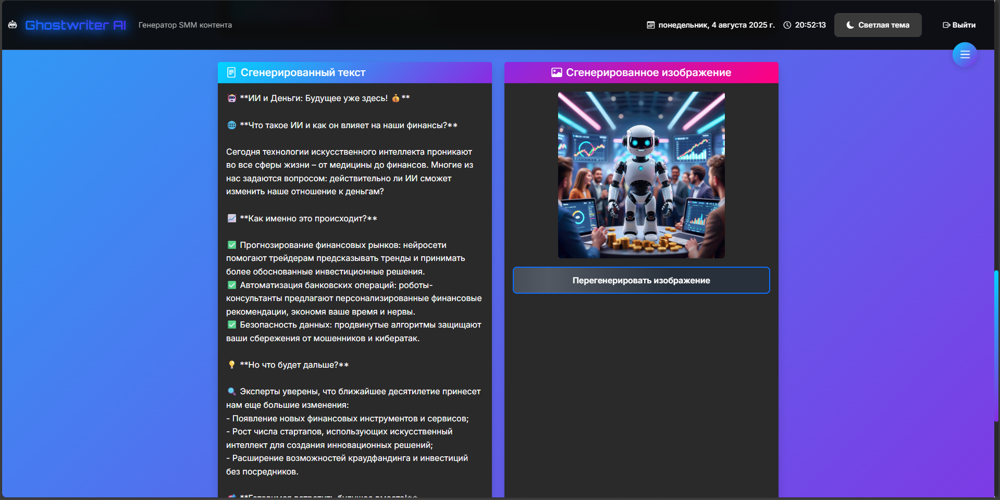
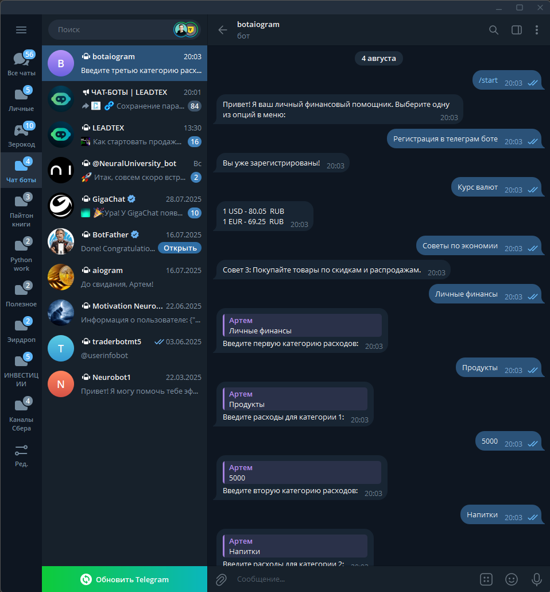
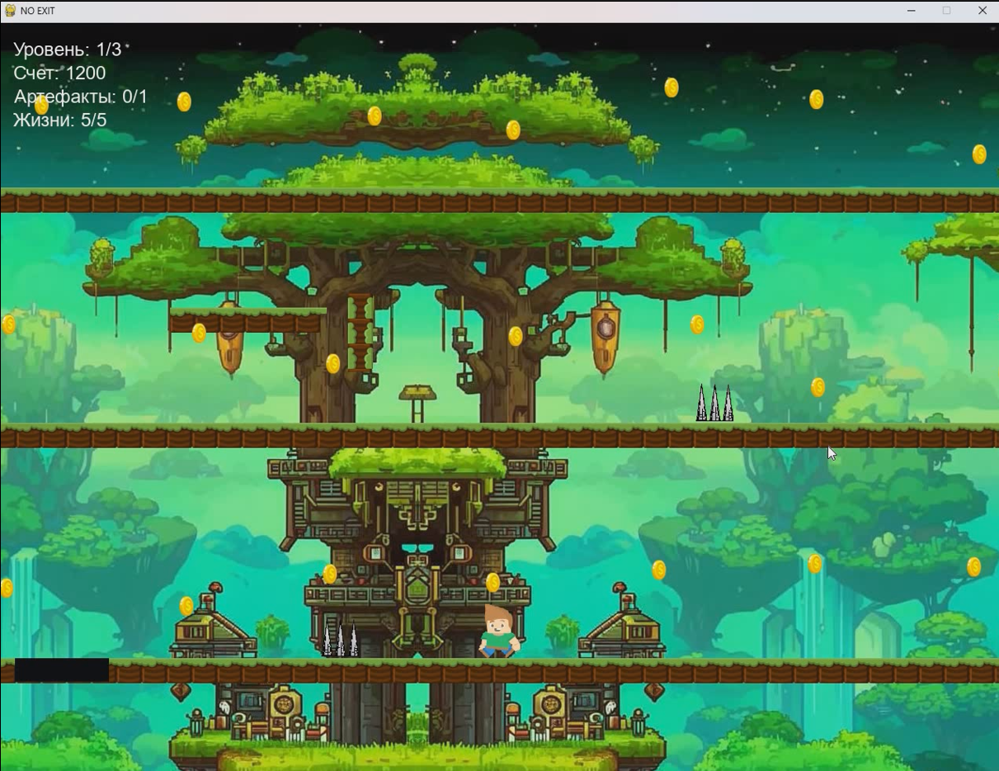
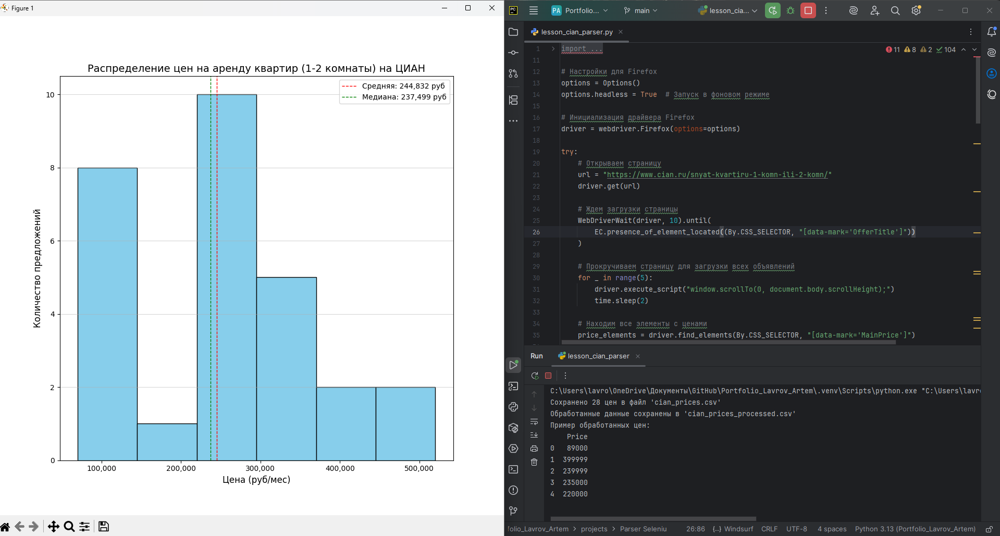

# Портфолио Артема Лаврова

## 🚀 Обо мне

Python-разработчик с опытом создания:
- Desktop-приложений (Tkinter, PyGame)
- Веб-решений (Flask, Django)
- Чат-ботов (Telebot, Aiogram)
- Парсеров данных (Selenium, Scrapy, Beautiful Soup)
- Работы с базами данных (SQL, MySQL, SQLite)

**Почему стоит выбрать меня?**
- ✅ Полный цикл разработки – от проектирования до запуска
- ✅ Гибкость в технологиях – работа с разными стеками
- ✅ Чистый и поддерживаемый код (SOLID, DRY, PEP8)
- ✅ Ответственность и соблюдение дедлайнов

## 🛠 Технические навыки

### Языки программирования
- Python
- HTML
- CSS

### Базы данных
- MySQL
- PostgreSQL

### Инструменты и технологии
- Git, Linux, Docker (базовый)
- PyCharm, Repl.it
- GPT, AI-инструменты

### Библиотеки Python
- **Web**: Flask, Django, Requests
- **Data**: Pandas, NumPy, Matplotlib
- **GUI**: Tkinter, Pygame, Pillow
- **Parsing**: Selenium, Scrapy, BeautifulSoup

## 🏆 Проекты

### 🎨 [Генератор контента для соцсетей - GhostWriter](https://github.com/Crowley55555/Ghostwriter.git)
<ul>
  <li>Генерация текстов для соцсетей <b>(VK, Дзен, Telegram, TikTok, Instagram, Facebook, Twitter/X, LinkedIn и др.)</b> с учетом платформенных особенностей.</li>
  <li>Гибкая настройка параметров: <i>тон голоса, цель, эмоциональный окрас, формат, стиль, призыв к действию (CTA), длина поста, использование хэштегов и упоминаний, адаптация под целевую аудиторию</i>.</li>
  <li>Автоматическая генерация релевантного изображения к посту.</li>
  <li>Сохранение и управление своими генерациями и шаблонами.</li>
  <li>Регистрация, авторизация, личный кабинет, редактирование профиля.</li>
  <li>Стена пользователя с историей генераций.</li>
  <li>Простой и интуитивный интерфейс.</li>
</ul>

### 🤖 [Финансовый бот в телеграме](https://github.com/Crowley55555/TG-05)
**Tg-05** - Telegram бот для управления финансами:
- 📝 Регистрация пользователей в системе
- 💱 Получение актуальных курсов валют (USD/RUB, EUR/RUB)
- 💡 Случайные советы по экономии
- 📊 Учет личных финансов по категориям
- 💾 Хранение данных пользователей в SQLite базе данных

### 🎮 [Игра "No-Exit" на PyGame](https://github.com/Crowley55555/2d-platformer.git)
2D-платформер с:
- Тремя уровнями сложности
- Интересным сюжетом
- Реализацией принципов ООП и SOLID
- Гибкостью в технологиях

### 🔍 [Парсер цен на аренду квартир с CIAN](https://github.com/Crowley55555/Cian-Parser.git)
Проект включает:
- Парсинг динамического контента
- Обработку данных (Pandas, NumPy)
- Визуализацию (Matplotlib)
- Генерацию CSV-отчетов

## 📫 Контакты

- 📧 Email: [lavrovartem0511@gmail.com](mailto:lavrovartem0511@gmail.com)
- 💻 GitHub: [Crowley55555](https://github.com/Crowley55555)
- 📂 Портфолио: [Portfolio_Lavrov_Artem](https://github.com/Crowley55555/Portfolio_Lavrov_Artem.git)
- 🔗 LinkedIn: [Указать ссылку](#)

## 🌐 Онлайн-версия портфолио
Доступна по ссылке: [Указать ссылку на GitHub Pages или хостинг](#)
